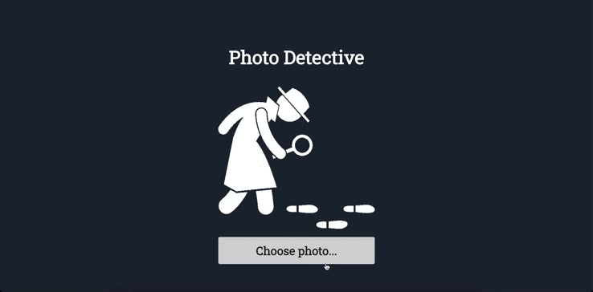

### Presentation of the diploma thesis 'Development of a Software Tool for Detecting Modifications in Digital Photographs'.

[Presentation](https://github.com/TanyaIgnatenko/image-insertion-detector-diploma-work/blob/main/Tatyana_Ignatenko-diploma-presentation.pdf)

Web application is available [here](https://photo-detective-front-3opm.vercel.app/)

Publication: https://e-lib.nsu.ru/reader/bookView.html?params=UmVzb3VyY2UtMzg2OQ/cGFnZTAwMDAwMA
